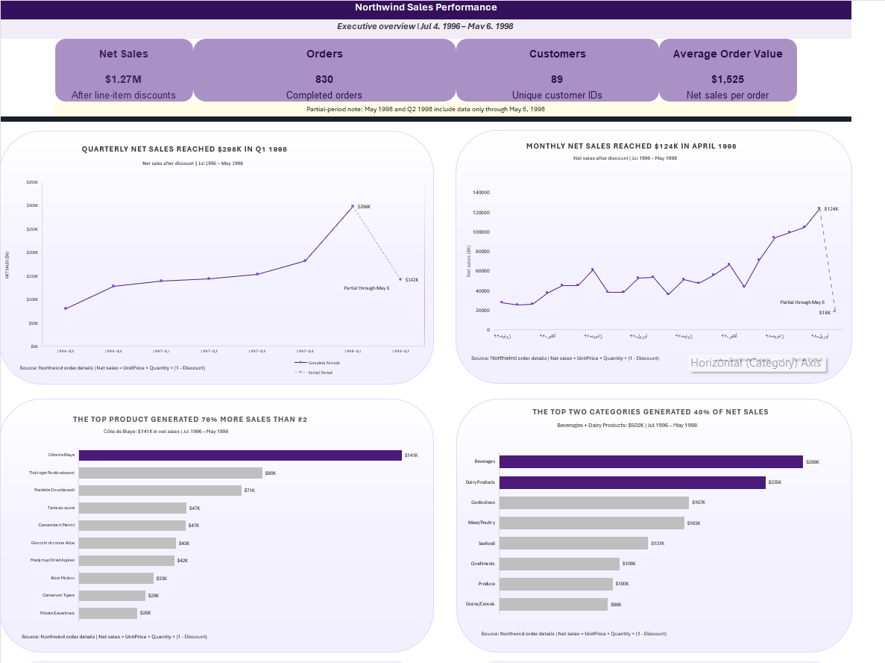
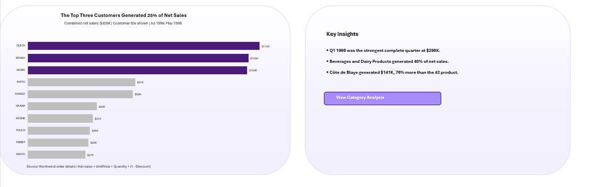
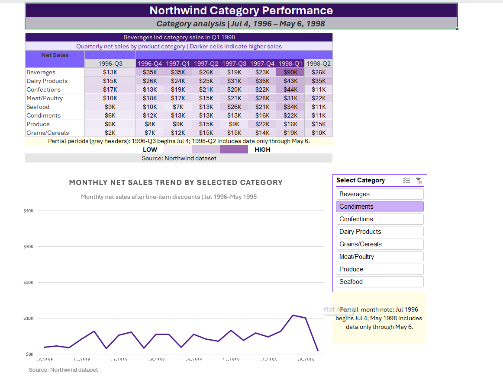

# Northwind Sales Analysis in Excel

This project started as Excel Exercise 04 from the Data Analyst Training Program at Tose'e Institute, taught by Dr. Majid Eyvazian.

The original assignment focused on combining the Northwind tables with XLOOKUP, calculating net sales, and answering several sales questions with PivotTables and PivotCharts. I completed those requirements and then expanded the workbook with two dashboard pages, data-quality checks, a validation log, and project documentation.

## Assignment Information

- **Institute:** Tose'e Institute
- **Instructor:** Dr. Majid Eyvazian
- **Course:** Data Analyst Training Program
- **Exercise:** Excel Exercise 04

The original assignment is available in the [`docs`](docs/Excel_Exercise_04_Assignment.pdf) folder.

## Original Assignment

The main tasks were:

- Combine the Orders and Order Details tables using `OrderID` and `XLOOKUP`
- Calculate net sales from unit price, quantity, and discount
- Add category names to the Products and Order Details data
- Analyze quarterly and monthly sales trends
- Find the top products, categories, and customers
- Compare category sales across quarters
- Review the monthly trend for each category

## My Approach

I kept the original source tables in separate sheets and built clean analysis tables for products and sales. I added the fields needed for reporting, including customer, product, category, order date, month, quarter, and net sales.

Net sales were calculated as:

`UnitPrice × Quantity × (1 - Discount)`

I used PivotTables as the support layer for the charts, then created an executive dashboard and a separate category analysis page. I also added validation checks so the final totals and lookup results could be reviewed before publishing the workbook.

## Dashboard

### Executive Dashboard - KPIs, Sales Trends, Products, and Categories

This section shows the main KPIs, monthly and quarterly sales trends, top products, and category performance.



### Executive Dashboard - Customer Results and Key Insights

This section shows the leading customers by net sales and summarizes the main findings from the analysis.



### Category Analysis

The category page contains a quarterly heatmap and a monthly trend chart. The slicer can be used to review one category at a time.



## Key Results

- Total net sales were **$1.27M** across **830 orders**.
- Q1 1998 was the strongest complete quarter, with **$298K** in net sales.
- April 1998 was the strongest complete month, with **$124K** in net sales.
- Côte de Blaye generated **$141K**, which was 76% more than the second-ranked product.
- Beverages and Dairy Products together generated 40% of total net sales.
- The top three customers generated 25% of total net sales.

## Workbook Structure

| Sheet | Purpose |
|---|---|
| `Raw_Categories` | Original category data |
| `Raw_Order_Details` | Original order-detail data |
| `Raw_Orders` | Original order data |
| `Raw_Products` | Original product data |
| `Sales_Data` | Prepared sales analysis table |
| `Products_Data` | Prepared product table |
| `Analysis_Support` | PivotTables and dashboard calculations |
| `Executive_Dashboard` | Main sales dashboard |
| `Category_Analysis` | Category heatmap and monthly trend |
| `Data_Validation` | Data-quality checks and correction log |
| `Documentation` | Project notes and methodology |

## Excel Features Used

- Excel Tables
- XLOOKUP
- PivotTables and PivotCharts
- Slicers
- Conditional Formatting
- Data validation checks
- Internal navigation links

## Data Quality and Validation

The workbook checks row counts, duplicate records, missing values, lookup results, source-data changes, sales totals, and dashboard support calculations. The final validation sheet contains **22 passed checks** and no items requiring review.

One invalid `UnitPrice` value was found for ProductID 42. The original value was kept in the raw data, while the corrected value of **$14.00** was used in the analysis table and recorded in the validation log.

## How to Use the Workbook

1. Download `Fatemeh_Kamrani_Northwind_Sales_Analysis.xlsx`.
2. Open it in Microsoft Excel desktop.
3. Start with the `Executive_Dashboard` sheet.
4. Open `Category_Analysis` for the heatmap and category trend.
5. Use the slicer to select a category.

Excel desktop is recommended because the workbook uses PivotTables, PivotCharts, a slicer, and internal navigation.

## Data Notes

- The analysis covers July 4, 1996 through May 6, 1998.
- July 1996 and May 1998 are partial months.
- Q2 1998 is a partial quarter.
- The dataset does not include product cost, profit, or sales targets.

## Project Files

```text
Fatemeh_Kamrani_Northwind_Sales_Analysis/
├── README.md
├── Fatemeh_Kamrani_Northwind_Sales_Analysis.xlsx
├── docs/
│   └── Excel_Exercise_04_Assignment.pdf
└── images/
    ├── executive_dashboard_01.png
    ├── executive_dashboard_02.png
    └── category_analysis.png
```

## Author

**Fatemeh Kamrani**  
[GitHub Profile](https://github.com/fatemehkamrani79)
